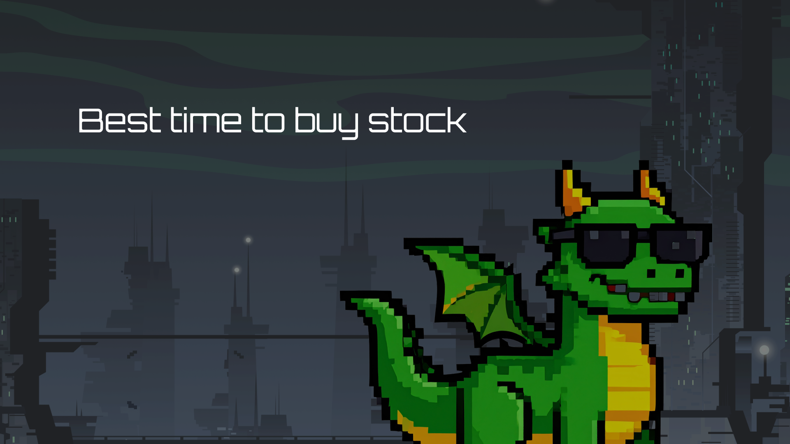

## 🕹️ BestTimeToBuyStock

> **Link to play:** _Coming soon_  
> This game hasn’t been released to a public server **yet**, but it will be available in the upcoming days. Stay tuned!

---

### 🎮 About the Game

Welcome to **BestTimeToBuyStock** — a gamified stock market simulation where you get five weeks to prove your trading genius.

At the heart of the experience is our very own **Game Master** — an AI-powered wizard of Wall Street who crafts a unique simulation for each session. It conjures news headlines, analyst ratings, and market sentiment to test your ability to read trends, sniff out fake news, and make smart investments.

Learn by doing, win by outsmarting. Every choice counts, every week reshapes your portfolio. Ready to play the market like a pro?

---

### 📜 How It Works

1. Choose **3 to 4 stock categories** to specialize in.
2. Start with a **$10,000** virtual portfolio.
3. Each week, receive updated:
   - Analyst ratings
   - Price targets
   - Market sentiment
   - AI-generated news headlines
4. Decide whether to **buy, sell, or hold**.
5. Advance to the next week and repeat the process.
6. At **Week 5**, all your holdings are **automatically sold** — it's profit-taking time!
7. See your final performance, share your score, and aim for the **top of the leaderboard**.

---

### 🧾 Sessions

Every game is played within a private **session** — a unique simulation generated just for you.

The **Game Master** will tailor your market journey from week 1 to 5, based on your chosen focus areas.

Once the final week ends, the session closes permanently. Your only trace? A spot on the **leaderboard** — if you earned it.

---

### 🧪 Data Pipeline

Before the game starts, we run a custom **data ingestion process** to feed the Game Master with real stock data and enriched context.

- We **fetch** stock information from the provided API using custom scripts.
- Another script uses **OpenRouter AI** to classify each stock into a meaningful category — giving the Game Master better narrative control.
- Additional scripts helped test early ideas (not worth mentioning here 😉).
- This part of the project was implemented in **Node.js** — out of pure love — though Python might've been the wiser choice.
- All data is written directly to **CockroachDB**, no fancy architecture needed — just solid, purpose-driven scripts.

---

### 🧰 Backend

The backend is written in **Go (Golang)**, structured with a clean **hexagonal architecture**, and powered by **CockroachDB** as the persistent data store.

#### Key Responsibilities:

- Handle the full **game lifecycle** (create session, fetch weekly data, perform trades, advance weeks, end session).
- Expose RESTful endpoints for the Vue frontend.
- Enforce trading rules, cash limits, and weekly transitions.
- Manage the **leaderboard** with only finished game sessions.

#### 🛡️ Design Decisions

1. **Ephemeral Game Sessions via Redis**  
   Instead of building a full auth/user system, sessions are treated as **one-time instances**:

   - When a game starts, a session is created and stored in **Redis**.
   - The game simulation (AI-generated content and user state) lives entirely in-memory.
   - Users have a **2-hour window** to finish before expiration.
   - Once finished, the session is persisted in **CockroachDB**, allowing it to show up on the leaderboard — but never to be replayed.

2. **AI Game Master — Heavy and Precise**  
   Each game is handcrafted by an AI wizard (via **OpenRouter**), guided by a finely tuned system prompt.
   - We built a robust **validation and cleanup** layer to ensure the AI's response is coherent and usable.
   - Game generation is a **CPU+token-heavy task**, taking **2–3 minutes per session**.
   - This is an area flagged for future optimization.

#### Tech Stack:

- **Go + GORM** for the API
- **CockroachDB** for permanent storage
- **Redis** for temporary session state
- **OpenRouter** for AI-powered market simulations

---

### 🎨 Frontend

The frontend is built with **Vue 3**, **TypeScript**, **Pinia**, and **Tailwind CSS** for styling.  
We focused on creating an **educational** and **engaging** user experience with clear UX patterns and playful touches.

#### Features:

- **Category selection** at game start
- Dynamic **weekly dashboard** with:
  - News headlines (some misleading 👀)
  - Analyst ratings & price targets
  - Your stock holdings and cash balance
- **Trade modal** with buy/sell options and validation
- **Advance week** button that triggers the next round
- Final week shows an **end session** button instead, triggering liquidation and leaderboard submission
- **Leaderboard page** to view the top 10 traders

#### UX Considerations:

- Real-time state synced with backend session
- Session ID is handled via **Pinia** + sessionStorage (fallback-safe)
- Final week includes a playful warning if you haven’t invested your funds

---

### 💬 Developer's Note

Before this challenge, I had **zero experience with Go or Vue**. But with a strong background in **Node.js** and backend distributed systems, I jumped in headfirst.

This was also my **first time building an AI-powered system**, and honestly — it’s been a blast. From prompt design to real-time game mechanics, every piece was a chance to learn and grow.

I'm **proud of what this became in just 2 weeks**, and I truly hope you enjoy playing it as much as I enjoyed building it.

Don’t worry — the server will be live soon. The Game Master is just catching its breath.
